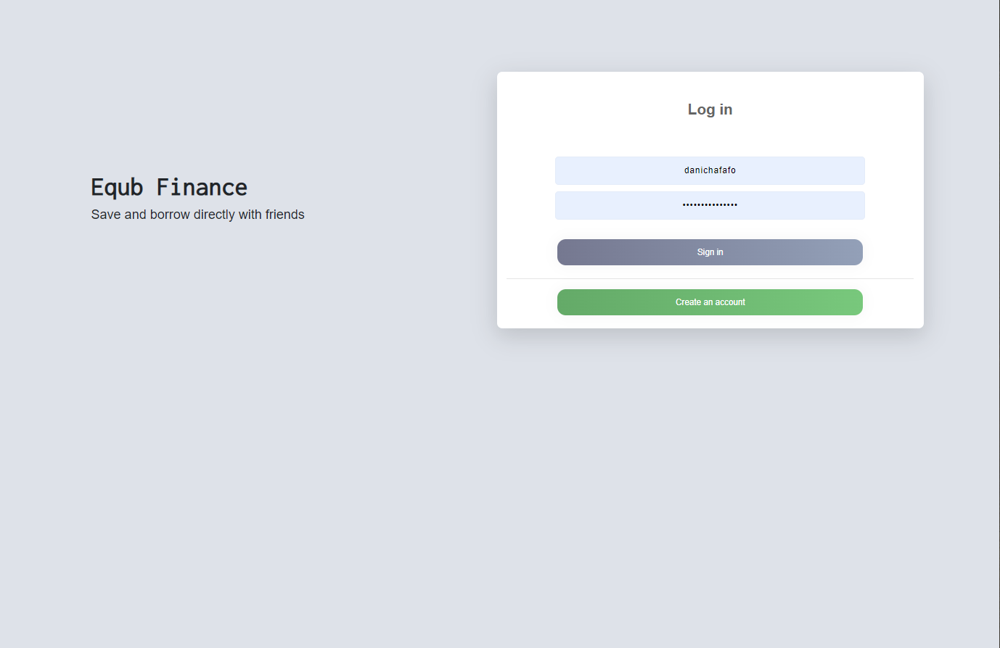
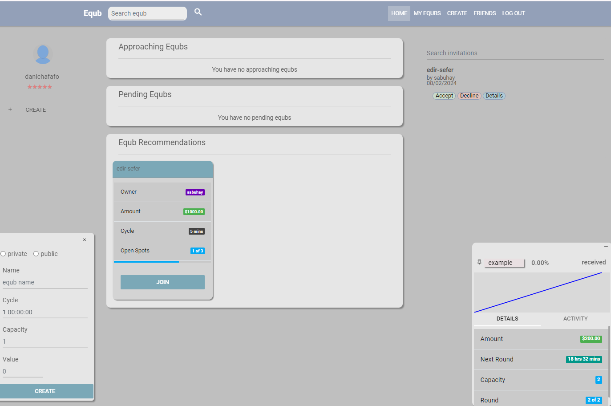

# Equb

Equb allows users to borrow and save money directly with another. A specified amount of money is periodically collected 
from all members of an Equb group. After each round of collection, the pooled money is deposited to the highest bidder. 
The amount paid by the highest bidder is distributed to members of the group who have not received the pooled money in 
previous rounds. 

<h3>Visit Website</h3>
To view a working version of Equb, go to <a href="https://equbfinance.com/">equb-finance.com</a>

<h3>Docker</h3>
To run Equb locally on your device with docker, follow the steps below:  

<ul>
    <li>download and start <a href="https://www.docker.com/products/docker-desktop">Docker</a> </li>
    <li>clone this repository</li>
    <li>navigate to the directory that has the Dockerfile </li>
    <li>run the command: <code>docker-compose build</code></li>
    <li>start the app: <code>docker-compose up</code></li>
</ul>

## Screenshots

    
    

